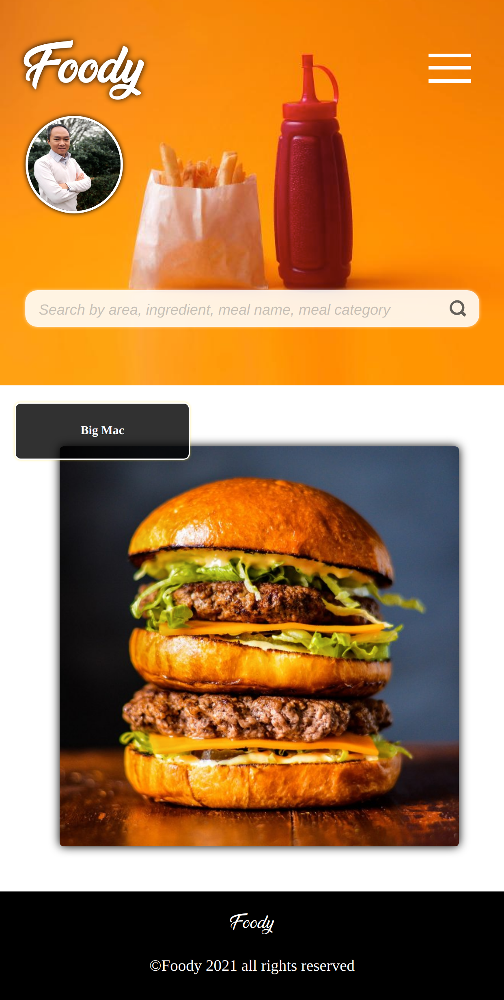
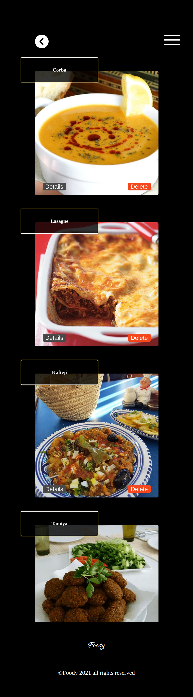
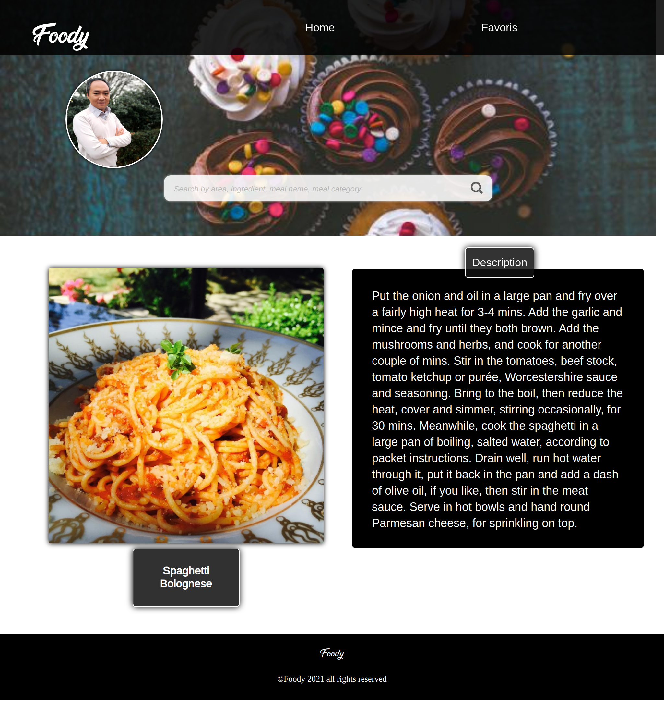

# Foody-React-App

Une application ReactJS pour les passionnées de cuisine nous permet de lister/filtrer les recettes de cusine en récupérant les informations d'une API (https://www.themealdb.com/api.php). C'est un projet de groupe dans le cadre de la formation à Simplon. 

    
    
    
    
     
     

## User Stories

En tant que visiteur du site je veux pouvoir :

- Trouvez des recettes via leurs :
    - nom
    - catégorie
    - ingrédient principale
    - pays d'origine
- Affichez le détails d'une recette => instruction / ingrédient&mesure / vidéo (si existante)
- Affichez une recette au hasard (son détails)
- Lister les catégorie de recettes
- Lister les pays d'origine
- Ajouter/lister/supprimer des recettes dans mes favories

## Instructions d'installation

    npx create-react-app foody-react-app
    npm start

- Installer axios pour faire de la requête API

        npm install axios
- Installer la route

        npm install react-router-dom

- Installer sass

        npm install node-sass

## Maquette de l'application

- Mobile

- Tablette

- Desktop

## Contributeurs
Charles EKOMIE Github: https://github.com/charade 

Puthpiseth TUN Github: https://github.com/Puthpiseth

Jerome ELIEZER VANEROT Github: https://github.com/eliezer-web

